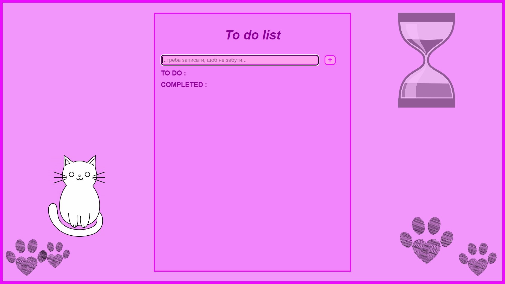

# To do list

This project uses **React** and implements the following logic and visual effects:
+ flex-box;
+ adaptive layout;
+ Hooks (useState, useEffect);
+ creating and deleting to do items.

### For the deployment of this project is used Netlify.
[Link for my project](https://prismatic-malabi-3e4d86.netlify.app)

